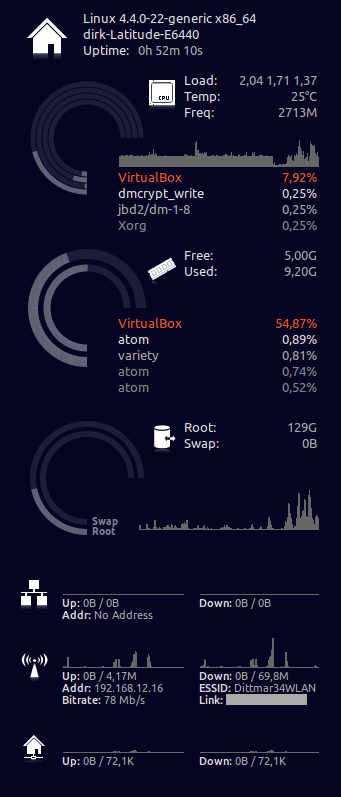

# conky_ddmod
 
Author: Dirk Dittmar  
Version: v1.0  
License: Distributed under the terms of GNU GPL version 2 or later  

This version is a modification of Conky Seamod wich is a modification of Conky Lunatico Rings wich is modification of conky_orange

conky_orange:         http://gnome-look.org/content/show.php?content=137503&forumpage=0  
Conky Lunatico Rings: http://gnome-look.org/content/show.php?content=142884  
Conky Seamod:         http://seajey.deviantart.com/art/Conky-Seamod-v0-1-283461046  
Icons:                http://msergt.deviantart.com/art/ecqlipse-2-PNG-59941546  

This is theme is made for Conky-Manager (http://www.teejeetech.in/p/conky-manager.html). Just make a new directory in /themes/ and copy this theme into it.

